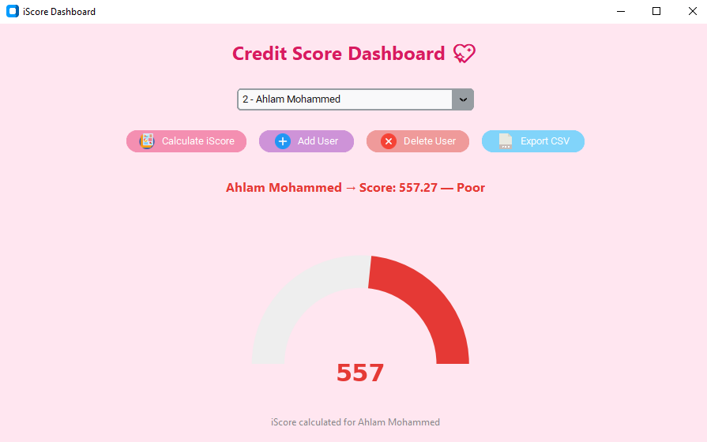

# Credit Score Dashboard (iScore)

[](https://github.com/1AyaNabil1/credit_score_project/actions/workflows/test.yml)

A Python desktop app that calculates a credit score, the **iScore** (300 to 850), for users whose credit data is split across five MySQL databases, and shows it on a colour-coded gauge. The GUI is built with `customtkinter` and `matplotlib`.

| Dashboard preview |
|-------------------|
|  |

## Features

- **Score a user.** Pick a user, click *Calculate iScore*, and see the score, its band (Poor to Excellent) and a half-donut gauge in the band's colour. The status line names any factor the user has no data for.
- **Add users.** Enter a name and a national ID. Both are validated, and a national ID that already exists is rejected.
- **Delete users.** The user is removed together with their records in all four score databases, in one transaction.
- **Export to CSV.** Writes every user's ID, name, score and band to a UTF-8 file.
- **Command line.** `python main.py` prints every user's score without opening the GUI.
- **National IDs stay out of view.** They are not shown in the user list, the GUI or the CSV export. They are still stored in plain text in `users_db`.
- **Light pink theme** with rounded icon buttons.

## How the iScore is calculated

Each factor becomes a component score from 0 to 100:

| Factor | Weight | Component score | Source table |
|---|---|---|---|
| Payment history | 35% | on-time payments / total payments | `payments_db.payment_records` |
| Credit usage | 30% | 100 − utilisation % (used credit / credit limit), floored at 0 | `debt_db.credit_usage` |
| Credit history | 15% | age of the oldest account / 10 years, capped at 100 | `history_db.credit_history` |
| Credit mix | 20% | credit types used / credit types available | `mix_reference_db.credit_mix` |

The weighted sum (0 to 100) is mapped linearly onto 300 to 850:

```
iScore = 300 + (0.35·payment + 0.30·usage + 0.15·history + 0.20·mix) / 100 × 550
```

The bands use the common FICO cut-offs: below 580 is **Poor**, 580 to 669 is **Fair**, 670 to 739 is **Good**, 740 to 799 is **Very Good**, and 800 or more is **Excellent**.

**Worked example (the screenshot above).** Seed user 2, Ahlam Mohammed, scored on 2025-05-08:

| Factor | Calculation | Component |
|---|---|---|
| Payment history | 9 / 12 | 75 |
| Credit usage | 1 − 7,000 / 10,000 | 30 |
| Credit history | 1,588 days since 2021-01-01 = 4.35 years, out of 10 | 43.51 |
| Credit mix | 1 / 4 | 25 |

0.35·75 + 0.30·30 + 0.15·43.51 + 0.20·25 = 46.7765, and 300 + 0.467765 × 550 = **557.27 (Poor)**. A unit test reproduces this number.

**Rules for real data:**

- A user can have several rows in a table. Payment records and credit lines are summed, the oldest account date is used, and the latest credit-mix row is used.
- A factor with no data counts as 0 and is reported as missing. A new user with no records scores 300.
- Values that cannot be right are reported as an error instead of being scored. Examples: negative amounts, more on-time payments than payments, more credit types than exist, and an account opened in the future.
- If MySQL cannot be reached, the app shows an error. It never falls back to a made-up score.

The formulas are in [`logic/scoring.py`](logic/scoring.py).

## Architecture

```
credit_score_project/
├── gui_run.py           # starts the GUI
├── main.py              # prints every user's iScore (command line)
├── gui/GUI.py           # CustomTkinter window: widgets and dialogs only
├── logic/
│   ├── scoring.py       # pure formulas, weights, bands, record validation
│   ├── calculator.py    # fetches a user's records and scores them
│   ├── validation.py    # checks on new-user input
│   └── export.py        # builds and writes the CSV
├── db/
│   ├── config.py        # ISCORE_DB_* settings (reads .env)
│   ├── connection.py    # one connection per query; raises DatabaseError
│   ├── users.py         # list, look up, add and delete users
│   └── payments.py, debt.py, history.py, mix.py   # fetch raw records
├── utils/
│   ├── schema.sql       # creates the five databases and their tables
│   └── test_data.sql    # six sample users with credit records
├── resources/           # button icons
├── img/                 # screenshots
└── tests/
```

The GUI calls `logic`, `logic` calls `db`, and only `db` talks to MySQL. The formulas never touch the database, the clock or the GUI, so they are tested without any of them.

The data lives in five databases: `users_db`, `payments_db`, `debt_db`, `history_db` and `mix_reference_db`. Each score table has a foreign key to `users_db.users`. Cross-database foreign keys only work when all five databases are on the same MySQL server.

## Quick start

You need:

- Python 3.10 to 3.13 with Tk (`tkinter`). CI tests 3.10 and 3.13. Homebrew Python needs the matching `python-tk` package.
- A MySQL 8 server and an account that can read and write the five databases. Root is fine for local use.

**1. Clone the repository**

```bash
git clone https://github.com/1AyaNabil1/credit_score_project.git
cd credit_score_project
```

**2. Set up the environment.** With venv:

```bash
python -m venv .venv
source .venv/bin/activate        # Windows: .venv\Scripts\activate
pip install -r requirements.txt
```

Or with Conda:

```bash
conda create -n credit_env python=3.10
conda activate credit_env
pip install -r requirements.txt
```

**3. Create the databases and load the sample data.** Run this once. The sample data cannot be loaded twice; to start over, drop the five databases first.

```bash
mysql -u root -p < utils/schema.sql
mysql -u root -p < utils/test_data.sql
```

**4. Configure the connection**

```bash
cp .env.example .env               # then set ISCORE_DB_PASSWORD in .env
```

**5. Run**

```bash
python gui_run.py                  # the dashboard
python main.py                     # or: print every user's score
```

Both scripts work from any directory.

## Configuration

Settings come from environment variables. A `.env` file in the project root is loaded too; it is git-ignored. Variables set in the shell override `.env`.

| Variable | Default | Meaning |
|---|---|---|
| `ISCORE_DB_HOST` | `localhost` | MySQL host |
| `ISCORE_DB_PORT` | `3306` | MySQL port |
| `ISCORE_DB_USER` | `root` | MySQL user |
| `ISCORE_DB_PASSWORD` | *(empty)* | MySQL password |
| `ISCORE_DB_CONNECT_TIMEOUT` | `5` | seconds to wait before reporting that MySQL is unreachable |

The database names are fixed by `utils/schema.sql`.

## Export format

The exported `.csv` file is UTF-8, so Arabic and other non-Latin names are kept. It has these columns:

- `User ID`
- `Full Name`
- `Score`: the calculated iScore
- `Band`: the score band, for example Poor or Good

Every score is calculated before the file is opened, so a database error never leaves a half-written file. A name that starts with `=`, `+`, `-` or `@` gets a leading `'`, so spreadsheet apps don't run it as a formula.

## Tests

```bash
pip install -r requirements-dev.txt
ruff check . && ruff format --check .
pytest
```

- **Unit tests** cover the formulas, bands, input validation, CSV export, settings and the data-access layer. The data-access tests use a fake `mysql.connector`, so they need neither MySQL nor a display.
- **GUI smoke test** (`tests/test_gui_smoke.py`). It builds the real window with the data layer faked, then runs the calculate, delete and export handlers. The window is hidden throughout. It runs when Tk and a display are available and is skipped otherwise.
- **MySQL integration tests** (`tests/test_mysql_integration.py`). They load `utils/schema.sql` and `utils/test_data.sql` and check the six sample users' scores against hand-calculated values. They also cover users with several rows, deleting a user who has records, adding a user, and the command line. They are opt-in.

  > **Warning:** these tests drop and recreate the five databases. Only point them at a throwaway server.

  ```bash
  # example: a disposable MySQL in Docker on port 3307 (give it a few seconds to start)
  docker run --rm -d --name iscore-test-mysql -p 3307:3306 -e MYSQL_ALLOW_EMPTY_PASSWORD=yes mysql:8.4
  ISCORE_RUN_DB_TESTS=1 ISCORE_DB_HOST=127.0.0.1 ISCORE_DB_PORT=3307 ISCORE_DB_PASSWORD= pytest
  ```

GitHub Actions ([`.github/workflows/test.yml`](.github/workflows/test.yml)) runs ruff, then the whole suite on Python 3.10 and 3.13. That includes the integration tests, against a MySQL 8.4 service container, and the GUI test, under `xvfb-run`.

## Limitations

- **This is a teaching model, not a real credit score.** The weights and formulas are simple and have not been validated against real repayment outcomes. Don't use it for lending decisions.
- **History is approximate.** It uses 365-day years and only the oldest account, so a score changes over time as accounts age.
- **No record editing.** The GUI can add and delete users but cannot add or edit their payment, debt, history or mix records; those are inserted with SQL.
- **No access control.** Anyone who can run the app with the database credentials can add and delete users.
- **One server.** The five databases are separate schemas on one MySQL server, not separate servers.
- **The GUI's font is Windows-only.** It uses Segoe UI; on macOS and Linux, Tk substitutes another font.
- **One Python/Tk combination fails.** Python 3.10 or 3.11 linked against Tk 9 (some recent standalone builds, such as uv-managed Pythons) fails inside CustomTkinter 5.2.2's combo box. Tk 8.6, which CI tests, works, and so does Python 3.12 with Tk 9.

## Contributing

Pull requests are welcome. For major changes, open an issue first to discuss the roadmap.

## License

MIT License: free to use, share, and adapt. See [LICENSE](LICENSE).

## Credits

Developed by Aya Nabil @ Alexandria University
